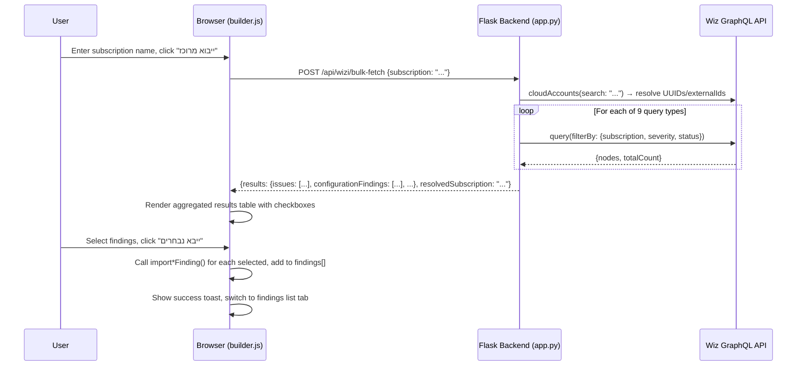

# Design Document: Subscription Bulk Import

## Overview

This feature adds a "ייבוא מרוכז" (Bulk Import) capability to the Wizi tab. Given a subscription name, the system queries all 9 Wiz query types for HIGH/CRITICAL severity findings in OPEN/IN_PROGRESS status, aggregates the results, and presents them in a unified table for selective import into the report.

The implementation follows the existing architecture: a new Flask backend endpoint handles the sequential multi-query orchestration (reusing the existing `_wizi_graphql()` proxy and subscription resolution logic), while the client-side JavaScript in `builder.js` manages the UI, progress display, and import via the existing `import*Finding()` functions.

### Design Decisions

1. **Backend orchestration over client-side**: A single `/api/wizi/bulk-fetch` endpoint runs all 9 queries server-side sequentially. This avoids 9 separate HTTP round-trips from the browser, simplifies error handling, and keeps the Wiz API credentials server-side. The endpoint returns a unified JSON response with results grouped by query type.

2. **Reuse existing filter logic**: The backend already has subscription resolution (`cloudAccounts` search → UUID/externalId) and per-query-type filter field mapping in `api_wizi_issues()`. The bulk endpoint reuses this same logic for each query type.

3. **Reuse existing import functions**: The client calls the same `importIssueFinding()`, `importConfigFinding()`, etc. functions that the single-query flow uses. No new mapping logic is needed.

4. **Duplicate detection by Wiz source ID**: Each Wiz finding node has a unique `id` field. Before importing, the system checks if any finding in `findings[]` was already imported from the same Wiz source ID (tracked via a `_wizSourceId` field on imported findings).

## Architecture



## Components and Interfaces

### Backend: `/api/wizi/bulk-fetch` Endpoint (app.py)

New POST endpoint that orchestrates the multi-query fetch.

```python
@app.route("/api/wizi/bulk-fetch", methods=["POST"])
def api_wizi_bulk_fetch():
    """Fetch findings across all 9 query types for a subscription."""
```

**Request body:**
```json
{
  "subscription": "AWS-Dev-Account-Name"
}
```

**Response body:**
```json
{
  "results": {
    "issues": { "nodes": [...], "totalCount": 12 },
    "configurationFindings": { "nodes": [...], "totalCount": 45 },
    "vulnerabilityFindings": { "nodes": [...], "totalCount": 3 },
    "hostConfigurationRuleAssessments": { "nodes": [...], "totalCount": 8 },
    "dataFindingsV2": { "nodes": [...], "totalCount": 0 },
    "secretInstances": { "nodes": [...], "totalCount": 2 },
    "excessiveAccessFindings": { "nodes": [...], "totalCount": 5 },
    "networkExposures": { "nodes": [...], "totalCount": 1 },
    "inventoryFindings": { "nodes": [...], "totalCount": 4 }
  },
  "resolvedSubscription": {
    "ids": ["uuid1", "uuid2"],
    "externalIds": ["ext1", "ext2"],
    "names": ["AWS-Dev-Account-Name"]
  },
  "errors": {
    "secretInstances": "GraphQL error: timeout"
  }
}
```

**Behavior:**
- Validates subscription is non-empty
- Resolves subscription name → UUIDs and externalIds (same logic as existing `api_wizi_issues`)
- Returns 404-style warning if subscription not found (but still attempts queries without subscription filter)
- Iterates all 9 query types, building filter objects per type:
  - Severity: `["CRITICAL", "HIGH"]`
  - Status: `["OPEN", "IN_PROGRESS"]` (or `["FAIL"]` for configurationFindings)
  - Subscription: per-type field mapping (UUID vs externalId)
- Fetches up to 500 results per query type (`first: 500`)
- For `excessiveAccessFindings`: no server-side subscription filter; returns all results (client filters)
- Catches per-query errors, stores in `errors` dict, continues with remaining types
- Returns aggregated results

### Client-Side: Bulk Import Module (builder.js)

New section within the existing Wizi integration block in `builder.js`.

**Key functions:**

| Function | Purpose |
|---|---|
| `handleBulkImport()` | Validates input, calls `/api/wizi/bulk-fetch`, renders results |
| `renderBulkResults(data)` | Builds the aggregated results table with collapsible sections |
| `importSelectedBulkFindings()` | Iterates selected checkboxes, calls appropriate `import*Finding()`, handles duplicates |
| `toggleBulkSection(queryType)` | Collapses/expands a query type section in the results |

**Import function routing:**

```javascript
var importFnMap = {
  'issues': importIssueFinding,
  'configurationFindings': importConfigFinding,
  'vulnerabilityFindings': importVulnFinding,
  'hostConfigurationRuleAssessments': importHostConfigFinding,
  'dataFindingsV2': importDataFinding,
  'secretInstances': importSecretFinding,
  'excessiveAccessFindings': importExcessiveAccessFinding,
  'networkExposures': importNetworkExposureFinding,
  'inventoryFindings': importInventoryFinding
};
```

### UI: Bulk Import Section (index.html)

Added at the top of `panel-wizi`, before the existing `<hr>` separator.

```html
<!-- Bulk Import Section -->
<div class="wizi-quick-add" id="bulk-import-section">
  <label>📦 ייבוא מרוכז לפי Subscription</label>
  <div class="row" style="align-items:end;">
    <div class="col">
      <input type="text" id="bulk-import-sub" placeholder="הזן שם Subscription..." dir="ltr">
    </div>
    <div class="col" style="max-width:160px;">
      <button class="btn btn-primary" id="btn-bulk-import">ייבוא מרוכז</button>
    </div>
  </div>
  <div id="bulk-import-progress" class="muted small-text" style="margin-top:6px;"></div>
  <div id="bulk-import-results" class="small-text" style="margin-top:8px;"></div>
  <div id="bulk-import-actions" style="display:none;margin-top:10px;">
    <button class="btn btn-primary" id="btn-bulk-import-selected">ייבא נבחרים לדו"ח</button>
    <button class="btn btn-secondary" id="btn-bulk-select-all">בחר/בטל הכל</button>
    <span id="bulk-selected-count" class="muted small-text" style="margin-right:10px;"></span>
  </div>
</div>
<hr style="border-color:var(--border);margin:16px 0;">
```

## Data Models

### Bulk Fetch Response (Backend → Client)

```typescript
interface BulkFetchResponse {
  results: {
    [queryType: string]: {
      nodes: WizFindingNode[];  // Same shape as existing per-query responses
      totalCount: number;
    };
  };
  resolvedSubscription: {
    ids: string[];        // Cloud account UUIDs
    externalIds: string[];  // Cloud account external IDs
    names: string[];      // Resolved cloud account names
  };
  errors: {
    [queryType: string]: string;  // Error message per failed query type
  };
}
```

### Client-Side Bulk Import State

```javascript
// Stored in closure alongside existing wiziIssues, etc.
var bulkImportResults = {};   // queryType → nodes[]
var bulkImportRunning = false; // Prevents concurrent operations
```

### Finding Object Extension (Duplicate Detection)

The existing finding object shape is extended with an optional tracking field:

```javascript
{
  // ... existing fields ...
  _wizSourceId: "abc-123-uuid"  // Wiz finding node.id, used for duplicate detection
}
```

This field is set by the bulk import flow and also retroactively by the existing single-import flow. It is excluded from report generation and JSON export (it's a transient client-side tracking field).

## Correctness Properties

*A property is a characteristic or behavior that should hold true across all valid executions of a system — essentially, a formal statement about what the system should do. Properties serve as the bridge between human-readable specifications and machine-verifiable correctness guarantees.*

### Property 1: Filter construction produces correct filter object per query type

*For any* query type (one of the 9 supported types) and any set of resolved subscription UUIDs and externalIds, the constructed filter object SHALL:
- Include severity `["CRITICAL", "HIGH"]` in the format appropriate for that query type (plain array or `{equals: [...]}`)
- Include the correct status filter: `["FAIL"]` for `configurationFindings`, `["OPEN", "IN_PROGRESS"]` for all others, in the format appropriate for that query type
- Use the correct subscription filter field name and ID type (UUID-based field for `issues`, `configurationFindings`, `hostConfigurationRuleAssessments`, `inventoryFindings`; externalId-based field for `vulnerabilityFindings`, `dataFindingsV2`, `secretInstances`, `networkExposures`; no server filter for `excessiveAccessFindings`)

**Validates: Requirements 2.2, 2.3, 2.6**

### Property 2: Total finding count equals sum of per-query-type counts

*For any* bulk import result containing findings across multiple query types, the displayed total count SHALL equal the sum of the individual per-query-type counts.

**Validates: Requirements 3.2**

### Property 3: Import routing calls the correct import function per query type

*For any* query type string and finding node, the import routing logic SHALL invoke the `import*Finding()` function that corresponds to that query type (e.g., `issues` → `importIssueFinding`, `configurationFindings` → `importConfigFinding`, etc.).

**Validates: Requirements 4.1**

### Property 4: Duplicate detection skips already-imported findings

*For any* set of findings to import where some share a Wiz source ID (`node.id`) with findings already present in the `findings[]` store, the import operation SHALL skip exactly those duplicates, the `findings[]` array length SHALL increase by only the count of non-duplicate findings, and the reported skip count SHALL equal the number of duplicates.

**Validates: Requirements 4.5**

## Error Handling

| Scenario | Handling |
|---|---|
| Empty subscription name | Client-side validation: show Hebrew error "יש להזין שם Subscription", do not call backend |
| Subscription not found | Backend returns `resolvedSubscription` with empty arrays; client shows warning toast but still displays any unfiltered results |
| Single query type fails | Backend catches exception, stores error message in `errors` dict, continues with remaining types; client shows warning per failed type |
| All query types fail | Client shows error message "לא הצלחנו לשלוף ממצאים — בדוק את החיבור ל-Wizi" |
| Network error (fetch fails) | Client catches fetch error, shows "שגיאת רשת" message, re-enables button |
| Wizi not configured | Backend returns 501; client shows "Wizi לא מוגדר" message |
| Rate limit exceeded | Existing rate limiter applies to POST endpoint; returns 429 |
| Concurrent bulk import | Client disables button during fetch; `bulkImportRunning` flag prevents re-entry |

## Testing Strategy

### Unit Tests (Example-Based)

- **Empty input validation**: Submit empty subscription, verify error message
- **Subscription not found**: Mock backend returning empty resolution, verify warning
- **Single query failure resilience**: Mock one query type failing, verify others succeed
- **Empty results**: All query types return 0 findings, verify empty state message
- **Select all / deselect all**: Toggle checkbox, verify all items change state
- **Tab switch after import**: Verify active tab changes to findings list
- **Toast message**: Verify import count in success toast
- **Button disable during fetch**: Verify button is disabled while request is in-flight
- **Severity chip styling**: Verify correct CSS classes for critical/high findings

### Property-Based Tests

Property-based tests use `fast-check` (JavaScript) for client-side logic and `hypothesis` (Python) for backend logic. Each test runs a minimum of 100 iterations.

- **Property 1** (filter construction): Generate random query types and subscription ID sets, verify filter object structure matches the expected schema per type. Use `hypothesis` to test the Python filter-building function.
  - Tag: `Feature: subscription-bulk-import, Property 1: Filter construction produces correct filter object per query type`

- **Property 2** (count invariant): Generate random result sets with varying numbers of findings per query type, verify total equals sum. Use `fast-check` to test the counting logic.
  - Tag: `Feature: subscription-bulk-import, Property 2: Total finding count equals sum of per-query-type counts`

- **Property 3** (import routing): Generate random query type strings from the 9 valid types, verify the correct import function is selected. Use `fast-check`.
  - Tag: `Feature: subscription-bulk-import, Property 3: Import routing calls the correct import function per query type`

- **Property 4** (duplicate detection): Generate random finding sets with some overlapping source IDs, verify skip count and final array length. Use `fast-check`.
  - Tag: `Feature: subscription-bulk-import, Property 4: Duplicate detection skips already-imported findings`

### Integration Tests

- **End-to-end bulk fetch**: With Wiz API credentials, run a bulk fetch for a known subscription and verify results are returned for multiple query types
- **Subscription resolution**: Verify that a known subscription name resolves to correct UUIDs/externalIds

